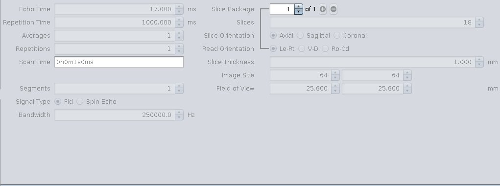

## Bruker PV6 guide   
*Courtesy BIL@UAnterp*  
 

### Positions
1. Location of the shim voxel. Preferably, the shim voxel should eb ~10% smaller, and the voxel boundaries should cross brain boundaries.    
Shimming can be performed using the anatomical scan, or a single repetition GE-EPI volume.
A B0 map should be acquired before performing the shimming. 
    

2. Slice pacakges. The first slice should just be at the end of the olfactory bulb. The last slice should be at the start of the cerebelum.     
 

3. The FOV saturation band (15 mm, not 4 mm as displayed below), should be located on the inferior boundaries of the slices. 
 

### Parameter cards

4. Exemple parameter cards from PV6.   
TR, TE, n slice, FOV, read-out direction, matrix size    
     
TR, TE, FA, FOV sat, Fat sat, dummies. **Note the FA is set incorrectly.**    
 
FOV sat. **Note the FOV sat band is set incorrectly.** 
 
FOV, matrix size.   
   
FOV, matrix size, slice gap, slice order, read-out direction.   
    
Bandwidth. **Note the bandwidth is set incorrectly.**   
    
Pulse detail. **Note, can change from system to system**   
    
Power detail. **Note, can change from system to system**  
 
Shim detail.  
     

### Image outputs

5. Left anatomical, right functional.   

