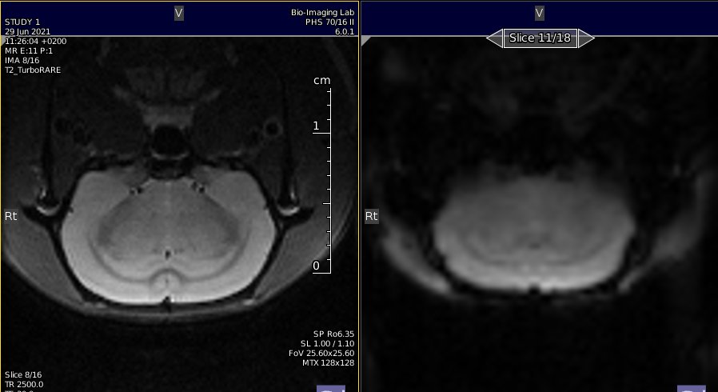

# StandardRat Protocol version 0.2

## Context

This is a sub-project of the [multiRAT collaboration](https://github.com/grandjeanlab/MultiRat). The aim of this project is the develop a robust, standardized, and minimal rat resting-state fMRI protocol. 

* **Robust:** the protocol should operate on systems operating at 4.7T to 11.7T (or above) field strength, and should be geared toward maximizing functional connectivity specificity (target 75% FC specificity within dataset). FC specificity is defined as high homotopic contralateral FC (S1-S1, r > 0.1) and low task-positive to task-negative FC (S1-ACA, r < 0.1). 

* **Standardized:** The protocol should contain sufficient detail to be applied with minimal variability between laboratories 

* **Minimal:** This should be an out-of-the-box protocol using sequences and animal procedures available in most (all) laboratories. 

## Protocol requirements 

- The protocol should take no longer than 1 h per rat to complete.   
- The protocol should run on a 4.7T with a standard cross-coil setup (The Andy Hess benchmark).   
- The protocol should work under various coil configurations (cross-coil, single-loop, phased-array).   
- The protocol should not require additional hardware (Non-standard cradle, capnograph, electrical stimulation device, ….)  
- The repetition time should be 1 s or less.   
- The protocol is designed for Wistar rats (mixed-sex, ~200-300g, or 2-4 months) but should be adaptable to other strains, weight.   
- Rats should be under (light) anesthesia and free-breathing to accommodate regulations from all countries.   

## Reporting

<b>Click to expand</b>

Two forms exist, one for logging the data, and one to assist with Burker 2 [Bids](https://bids.neuroimaging.io/) conversion. Non-bruker users may consider dicom to [BIDS converter](https://github.com/Donders-Institute/bidscoin)  instead.  

- **Basic report sheet.**    
[.csv](assets/table/StandardRat_template.csv) [.xlsx](assets/table/StandardRat_template.xlsx)) [gdoc sheet](https://docs.google.com/spreadsheets/d/1XTpR9kzGYfmFkvJUGIgkbxjZsCw-vzUnvzgGN_Aqj3g/edit?usp=sharing)   

- **Scan info sheet for Burker to BIDS conversion.** Adapted from [BrkRaw](https://github.com/BrkRaw/brkraw)   
[.csv](assets/table/StandardRat_study_2_bids.csv) [.xlsx](assets/table/StandardRat_study_2_bids.xlsx)) [gdoc sheet](https://docs.google.com/spreadsheets/d/1fvK3-pSJDSovD3FhTMdtu1J8vPZPb8FRBgkEZqVSg8o/edit?usp=sharing)    

**Protocol deviations**
Protocol deviations due to local constraints can be reported in the table above __**Anesthesia_deviation**__ and __**Func_deviation**__ for anesthesia and acquisition deviations, respectively. 

## Anesthesia
   
**Anesthesia graphical summary.** *Courtesy BIL@UAnterp*  

<b>Click to expand</b>

### General remarks    
* Subcutaneous injection & infusion (skin fold at the back of the rat, perform bolus on the opposite side of where the infusion cannula will be)   
* Isoflurane is in a mixture of 200mL/min O2 & 400mL/min N2 (or 100 ml/min O2 & 500 mL/min Air)   

### Products
* 1mL syringes    
* Needles 26G   
* Butterfly catheter   
* PE tubing with 26G needles at both ends + connectorpiece to connect to butterfly catheter   
* Isoflurane (Isoflo®)   
* Medetomine (Domitor ®1 mg/mL). __If using Dexdetomine, use half-dose__   
* Infusion pump   
* Scale   
* Saline
* (optional) Super glue or tissue glue (to fixate s.c. catheter from moving/leaking)

### Dilutions
Infusion-line = pure domitor (1 mg/mL)   
* Speed of the pump in mL/hr => weight in kg/10     
    * E.g., 300g rat = 0.030 mL/hr  
Bolus = 1/10 solution of medetomine in 0.9% NaCl solution   
* Injection volume in mL => weight in kg/2   
    * E.g., 300g rat = 0.150 mL    
Atipamezole (Antisedan)   
* 1/10 dilution (0.5 mg/mL)   
* Injection volume in mL => weight in kg   
    * E.g., 300g rat = 0.300 mL Antisedan
    
### Anesthesia protocol

*Induction of anesthesia*    
* Write down the start time of the induction (*Induction_time* in [StandardRat_template](https://docs.google.com/spreadsheets/d/1fvK3-pSJDSovD3FhTMdtu1J8vPZPb8FRBgkEZqVSg8o/edit?usp=sharing))
* 2-3 minutes
* 4% ISF in mixture of 200mL/min O2 & 400mL/min N2 (until loss of reflexes)   
* Weigh the animal to estimate the dosage of medetomidine (*Weight* in [StandardRat_template](https://docs.google.com/spreadsheets/d/1fvK3-pSJDSovD3FhTMdtu1J8vPZPb8FRBgkEZqVSg8o/edit?usp=sharing))   

*Animal handling/positioning of the animal*   
* Max 10 minutes (aim for as short as possible – just practice the positioning of the animal)   
* 2-2.5% ISF in mixture of 200mL/min O2 & 400mL/min N2 

*T0 min*   
* Subcutaneous bolus of 0.05 mg/kg medetomidine (Domitor®)   
* Give injection once everything is in place!   
* Note down the time that you’ve injected (*Bolus_time* in [StandardRat_template](https://docs.google.com/spreadsheets/d/1fvK3-pSJDSovD3FhTMdtu1J8vPZPb8FRBgkEZqVSg8o/edit?usp=sharing))   
* Keep an eye on the breathing rate, might suddenly drop (adjust ISF immediately!)   

Slide the animal in the scanner   

Gradually lower the isoflurane based on the breathing rate over the course of 20 minutes to 0.4%   

*T15 min*  
* Subcutaneous continuous infusion of 0.1 mg/kg/h medetomidine (Domitor®) + 0.4% Isoflurane in mixture of 200mL/min O2 & 400mL/min N2   
* Make sure to start the infusion in time, the start of the infusion is usually when you are acquiring the TurboRARE images (easy to forget time when you’re aiming for the perfect image)   

Lower the ISF to 0.4% at least __**10 minutes**__ in advance of the start of the rsfMRI scan!   
*T40 min* = start rsfMRI acquisition   

*After scanning*   
Stop the infusion pump immediately after you’ve finished the last rsfMRI scan   
* Increase ISF if further scans are necessary   
Get the animal out of the scanner & inject sc. with 0.5 mg/kg Atipamezole (Antisedan ® 5mg/mL)    
Let the animal recover under the infrared light

## MRI protocol 

<b>Click to expand</b>

*Guide*   
Bruker (PV6, 7T) [picture guide](Bruker_guide.md) for slice position and parameter cards.     

*Equipment*   
Any field strength. Refer to the table to B0-dependant parameters   
Any coil. Refer to the instruction for T/R surface coil-only   
MRI-compatible cradle (e.g., Bruker craddle)   
Bite bar   
Ear bars   
Breathing pillow   
Rectal thermometer   

*Anatomical*   
turboRARE (*optional parameters*)   
Axial slice (copy the geometry to the functional images)   
TR = 2500 ms   
TE(eff) = 30 ms   
NAverage = adapt as a function of B0 / coil combo. Usually 1-4.  
RARE factor = 8   
FA = 90, 180   
FOV = 25.6 x 25.6 mm    
Matrix size = 128 x 128   
FOV sat = yes (no if using T/R surface coil)   
FOV sat geometry = 15 mm positioned below the skull  (see image below)   
Fat sat = yes   
Read-out = LR   
number of slice = 18 (see image below)   
slice thickness = 1 mm   
slice gap = 0.1 mm   
slice order = interleaved  

    
Location of the slice package, to be copied to the GE-EPI geometry.    

*Shimming*   
Shimming with MAPSHIM following B0 maps acquisition.   
Shimming is performed on an ellipsoid (*optional, PV6 and above*) or rectangle/square voxel into the cerebrum.(see image below).    
It is recommended to run a single volume GE-EPI scan to ensure distortions are minimal before running the full GE-EPI functional scan.  
Shimming performance can be tested using a PRESS voxel (*5 x 5 x 5 mm, centered in the cerebrum*) and measuring line width.   

    
Location of the shim voxel. Preferably, the shim voxel should eb ~10% smaller, and the voxel boundaries should cross brain boundaries.      

*Functional*   
Single shot, single echo, gradient echo - echo planar image (GE-EPI) sequence    
Axial slice (copy the geometry from the anatomical images)   
TR = 1000ms   
FOV = 25.6 x 25.6 mm   
matrix size =  64 x 64   
FOV sat = yes (no if using transmit/receive surface coil)   
FOV sat geometry = 15 mm positioned below the skull  ()   
Fat sat = yes   
Read-out = LR   
number of slice = 18    
slice thickness = 1 mm   
slice gap = 0.1 mm   
slice order = interleaved   
repetitions = 1000   
Dummy scan = 10   
Acceleration = No   

*Variable parameters*   

|  | 3T | 4.7T | 7T | 9.4T   | 11.7T  | 14.1T | 17.2T | 
| ---: | :---: | :---: | :---: | :---: | :---: | :---: | :---: |
| TE [ms] | 30 | 25 | 17 | 15 | 12 | 10 | 9 | 
| FA [degree] | 64 | 61 | 55 | 53 | 52 | 51 | 50 | 
| Bandwidth [kHz] | 180 | 200 | 220 | 250 | 250 | 300 | 300 | 

T1 values used the following values [1000, 1400, 1800, 2000, 2100, 2200], based on the values [here](https://pubmed.ncbi.nlm.nih.gov/16767752/), and [here](https://www.ncbi.nlm.nih.gov/pmc/articles/PMC7248563/), and used the [mritoolbox](http://www.mritoolbox.com/ErnstAngle.html) to estimate angles   

TE is based on the ~ half T2* in the grey matter. Unfortunately, I couldn’t find this parameter in the rat brain as a function of B0. [This](https://onlinelibrary.wiley.com/doi/full/10.1002/mrm.20946) only reports T2. Currently, proposed values are based on user usage.  

## Selected outcomes (left anatomical, right functional)  

<b>Click to expand</b>

   

    

    

